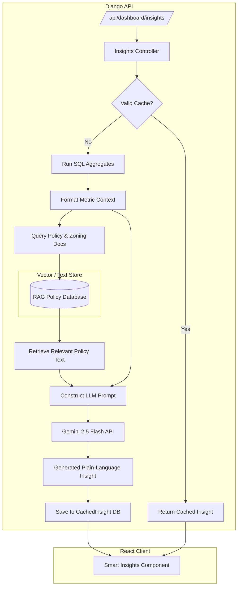
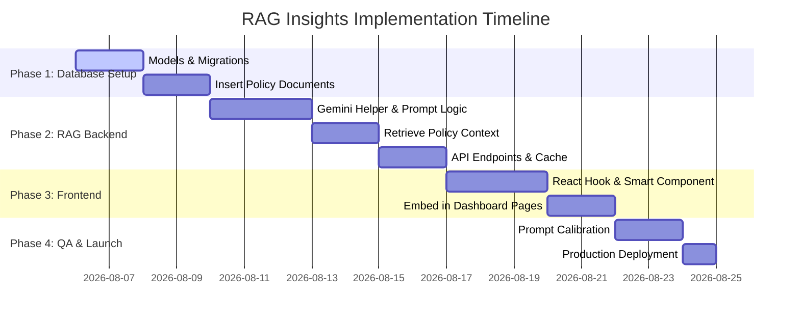

# Technical Specification: RAG-Based Analytics Insights
**System Reference:** FarmPass v2.1 — AI-Driven Operational Intelligence

---

## 1. Executive Summary & Objective

The FarmPass platform currently collects substantial quantitative data regarding swine density, permit applications, transit history, payments, and inspection logs. This data is visualized via charts and KPI grids. However, charts alone only tell users **what** is happening, not **why** it is happening or **what actions** should be taken.

This specification outlines the design and implementation of a **Retrieval-Augmented Generation (RAG)** intelligence layer. By combining dynamic database aggregates with semi-static regulatory and biosecurity policies (e.g., African Swine Fever zoning, provincial transport regulations, document compliance guidelines), the system will generate **plain-language, role-specific insights** directly on user dashboards.

### Target Audiences & Use Cases
1. **Agriculture Officer (Municipal Level):** Needs to translate swine density maps and revenue collection trends into resource allocation and biosecurity surveillance strategies.
2. **Validator / Checker (OPV Staff):** Needs to understand application patterns, high-frequency rejection causes, and geographical bottlenecks to optimize verification workflows.
3. **Inspector (Checkpoints):** Needs real-time awareness of active road permits, peak traffic hours, and risk patterns (e.g., potential route bypasses or high-risk origin zones).

---

## 2. Architecture & Data Flow

The RAG Insights feature utilizes a light, low-latency pipeline combining SQL aggregates, policy document embeddings, and the **Google Gemini API** (using the existing `settings.GEMENI_API_KEY` configuration).

### Systems Architecture Diagram


### Context Retrieval Strategy
Because policy documents (ASF updates, municipal ordinances, veterinary guidelines) are relatively small and slow-changing, they will be chunked and indexed.
- **Option A (Simpler, Low-Overhead):** Store raw Markdown text of key policies directly in the database. Use keyword search or metadata tags (e.g., tag matches for `rejection`, `asf`, `density`, `barangay_name`) to retrieve matching clauses.
- **Option B (Advanced, Semantic):** Implement a vector-based retrieval system using `sqlite-vss` or a lightweight vector library (like ChromaDB or FAISS) inside the `apps/ml_engine` module.

> [!TIP]
> **Recommended Approach:** Start with **Option A (Metadata/Keyword-Tagged Policies)**. This is highly deterministic, fast, runs without additional infrastructure in SQLite, and meets 95% of agricultural compliance logic requirements.

---

## 3. Database Schema Design

Two Django models will be created in the `apps/dashboard/models.py` or a new `apps/ml_engine/models.py` module to manage policy documents and cached insights.

```python
# file:///C:/Users/jico/Documents/capstoneV2/backend/apps/dashboard/models.py
from django.db import models
from django.contrib.auth import get_user_model

User = get_user_model()

class InsightPolicyDocument(models.Model):
    """
    Knowledge base for RAG. Stores local ordinances, biosecurity rules,
    ASF zoning guidelines, and document compliance check sheets.
    """
    class Category(models.TextChoices):
        BIOSECURITY = 'BIOSECURITY', 'Biosecurity & Quarantine Protocols'
        ASF_ZONING = 'ASF_ZONING', 'African Swine Fever Zoning Rules'
        DOCUMENTATION = 'DOCUMENTATION', 'Permit & Document Compliance Guidelines'
        MUNICIPAL_CODE = 'MUNICIPAL_CODE', 'Municipal Ordinances & Fees'

    title = models.CharField(max_length=255)
    category = models.CharField(max_length=50, choices=Category.choices)
    content = models.TextField(help_text="Markdown format of the policy content.")
    tags = models.CharField(max_length=255, help_text="Comma-separated keywords (e.g., 'rejection, handlers_license, pink_zone')")
    last_updated = models.DateTimeField(auto_now=True)

    def __str__(self):
        return f"[{self.get_category_display()}] {self.title}"


class CachedInsight(models.Model):
    """
    Caches LLM-generated insights to avoid excessive API calls and optimize dashboard latency.
    """
    class RoleChoices(models.TextChoices):
        AGRI = 'Agri', 'Agriculture Officer'
        OPV = 'OPV', 'OPV Validator'
        INSPECTOR = 'Inspector', 'Inspector'

    role = models.CharField(max_length=20, choices=RoleChoices.choices)
    insight_markdown = models.TextField()
    sources = models.ManyToManyField(InsightPolicyDocument, blank=True)
    generated_at = models.DateTimeField(auto_now_add=True)
    expires_at = models.DateTimeField()

    class Meta:
        ordering = ['-generated_at']

    def is_expired(self):
        from django.utils import timezone
        return timezone.now() > self.expires_at

    def __str__(self):
        return f"Insight for {self.get_role_display()} ({self.generated_at.strftime('%Y-%m-%d %H:%M')})"
```

---

## 4. Backend Implementation Plan

### 4.1. LLM Integration Client
A helper class in `backend/apps/dashboard/services.py` will communicate with Google Gemini using `settings.GEMENI_API_KEY`.

```python
# file:///C:/Users/jico/Documents/capstoneV2/backend/apps/dashboard/services.py
import google.generativeai as genai
from django.conf import settings
import logging

logger = logging.getLogger(__name__)

class GeminiClient:
    """Helper service to interact with Gemini API."""
    def __init__(self):
        # Note the spelling in settings: GEMENI_API_KEY
        api_key = getattr(settings, "GEMENI_API_KEY", None)
        if api_key:
            genai.configure(api_key=api_key)
        else:
            logger.warning("Gemini API Key (GEMENI_API_KEY) is not configured in settings.")

    def generate_content(self, system_instruction: str, prompt: str) -> str:
        try:
            model = genai.GenerativeModel(
                model_name="gemini-2.5-flash",
                system_instruction=system_instruction
            )
            response = model.generate_content(
                prompt,
                generation_config=genai.types.GenerationConfig(
                    temperature=0.2, # Low temperature for factual, analytical results
                    max_output_tokens=800,
                )
            )
            return response.text
        except Exception as e:
            logger.error(f"Gemini API Error: {str(e)}")
            return "Unable to generate insights at this time. Please check backend services."
```

### 4.2. Role-Specific Prompt Templates & Retrieval Queries

#### A. Agriculture Officer (Agri)
- **Data Extracted:** Swine density rankings, monthly transport volumes, monthly revenue trends, status distribution.
- **RAG Policy Query:** Searches for policy tags related to `density`, `asf_zoning`, `quarantine_fees`.
- **System Instruction:**
  > You are the FarmPass Municipal Analyst. Write in the second person ("you", "your"). Adhere strictly to the FarmPass Plain Language Guidelines: use active voice, short sentences, and avoid engineering terms. Do not use markdown tables or headers higher than h3. Focus on what the metrics mean for municipal health, revenue targets, and vaccine deployments.

#### B. Validator / Checker (OPV Staff)
- **Data Extracted:** Pending validations, pass/rejection rates, top rejection categories (extracted dynamically from the validator remarks), top origin/destination Barangays.
- **RAG Policy Query:** Searches for policy tags related to `document_check`, `rejection_rules`, `handlers_license`.
- **System Instruction:**
  > You are the OPV Validation Workflow Assistant. Write in the second person ("you", "your"). Use simple language. Review the validation backlog and rejection trends. Cross-reference them with document guidelines to suggest operational improvements (e.g., changes to instruction copy, validator checkpoints). Keep it concise.

#### C. Inspector (Checkpoints)
- **Data Extracted:** Total checkpoint scans, peak hours of transit activity, count of active road permits.
- **RAG Policy Query:** Searches for policy tags related to `checkpoint_rules`, `road_inspection`, `asf_movement_restrictions`.
- **System Instruction:**
  > You are the Checkpoint Security Advisor. Write in the second person ("you", "your"). Analyze peak transport times and verification activity. Advise on scheduling patrol shifts and identifying transport runs that deviate from expected timetables or high-density risk areas.

---

## 5. API Endpoint Specifications

The insights will be served via a secure REST API endpoint.

### `GET /api/dashboard/insights/`
- **Authentication:** Required (JWT Bearer Token).
- **Access Control:** Automatically fetches insights matching the authenticated user's role (`request.user.role`).
- **Response Headers:** Cache-Control: max-age=3600 (Allows clients to store locally).

#### Example JSON Response:
```json
{
  "role": "Agri",
  "generated_at": "2026-08-05T20:45:00Z",
  "expires_at": "2026-08-05T23:45:00Z",
  "insight": "### 📋 Key Operations Insight\n* **Swine Density Watch:** Barangay Concepcion currently holds 28% of the registered swine population in the municipality. Monitor this zone closely as it shares a border with a neighboring municipality under ASF surveillance.\n* **Permit Bottleneck:** There are currently **12 applications** waiting for manual review. Most of these have document alignment errors flagged by OCR on the Handler's License.\n* **Action Item:** Allocate municipal veterinary visits to Barangay Concepcion to perform routine blood tests before transport spikes scheduled for late next week.",
  "sources": [
    {
      "title": "Municipal African Swine Fever Zoning Directive v3",
      "category": "African Swine Fever Zoning Rules"
    },
    {
      "title": "Standard Operating Procedure for Swine Transit",
      "category": "Biosecurity & Quarantine Protocols"
    }
  ]
}
```

---

## 6. Frontend UI/UX Design

The visual presentation must align strictly with the **FarmPass Design System**:
1. **White-first surfaces** for maximum readability (`bg-white`).
2. **Flat UI only** — borders define structure (`border-stone-200`), **never use shadows**.
3. **Square corners** (`rounded-none`).
4. **Typography**: High-signal uppercase labels (`text-[10px] font-black uppercase tracking-widest text-stone-600`), readable body text (`text-sm text-stone-800`).
5. **Icons**: Lucide icons (`Sparkles`, `BookOpen`, `RefreshCw`, `AlertCircle`) at 16px size.

### Smart Insights React Component
This component can be imported and placed at the top or side of each respective dashboard:

```jsx
// file:///C:/Users/jico/Documents/capstoneV2/frontend/src/components/ui/SmartInsights.jsx
import React, { useState } from 'react';
import { Sparkles, BookOpen, RefreshCw, AlertCircle } from 'lucide-react';
import { useQuery, useMutation, useQueryClient } from '@tanstack/react-query';
import api from '/src/utils/api'; // Assuming standard axios instance

const SmartInsights = () => {
    const queryClient = useQueryClient();
    const [isRefreshing, setIsRefreshing] = useState(false);

    // Fetch insights query
    const { data, isLoading, isError, refetch } = useQuery({
        queryKey: ['dashboard_insights'],
        queryFn: async () => {
            const res = await api.get('/dashboard/insights/');
            return res.data;
        },
        staleTime: 1000 * 60 * 30, // 30 minutes cache validity on client
    });

    // Refresh insight mutation (forces backend bypass of cache)
    const refreshMutation = useMutation({
        mutationFn: async () => {
            setIsRefreshing(true);
            const res = await api.post('/dashboard/insights/refresh/');
            return res.data;
        },
        onSuccess: (newData) => {
            queryClient.setQueryData(['dashboard_insights'], newData);
            setIsRefreshing(false);
        },
        onError: () => {
            setIsRefreshing(false);
        }
    });

    if (isLoading) {
        return (
            <div className="bg-white border border-stone-200 p-6 rounded-none animate-pulse">
                <div className="flex justify-between items-center mb-4">
                    <div className="h-4 w-32 bg-stone-100"></div>
                    <div className="h-4 w-4 bg-stone-100"></div>
                </div>
                <div className="space-y-3">
                    <div className="h-3 w-full bg-stone-100"></div>
                    <div className="h-3 w-5/6 bg-stone-100"></div>
                    <div className="h-3 w-4/6 bg-stone-100"></div>
                </div>
            </div>
        );
    }

    if (isError) {
        return (
            <div className="bg-red-50 border border-red-200 p-4 rounded-none text-red-700 flex items-start gap-3">
                <AlertCircle size={16} className="mt-0.5 shrink-0" />
                <div>
                    <p className="text-[10px] font-black uppercase tracking-widest">System Warning</p>
                    <p className="text-xs mt-1">We couldn't load your smart operational insights. Please reload or contact support.</p>
                </div>
            </div>
        );
    }

    const { insight, sources } = data;

    return (
        <div className="bg-white border border-stone-200 rounded-none p-6 flex flex-col space-y-4">
            {/* Header */}
            <div className="flex justify-between items-center border-b border-stone-100 pb-3">
                <div className="flex items-center gap-2">
                    <Sparkles size={16} className="text-green-700" />
                    <h2 className="text-[10px] font-black uppercase tracking-widest text-stone-800">
                        Smart AI Insights
                    </h2>
                </div>
                <button 
                    onClick={() => refreshMutation.mutate()} 
                    disabled={isRefreshing}
                    className="p-1 text-stone-500 hover:bg-stone-50 transition-colors duration-100 rounded-none disabled:opacity-50"
                    title="Refresh Insights"
                >
                    <RefreshCw size={14} className={isRefreshing ? "animate-spin" : ""} />
                </button>
            </div>

            {/* Insight Text */}
            <div 
                className="text-sm text-stone-800 leading-relaxed font-normal prose prose-stone max-w-none prose-sm"
                dangerouslySetInnerHTML={{ __html: insight }}
            />

            {/* RAG Citations */}
            {sources && sources.length > 0 && (
                <div className="pt-3 border-t border-stone-100">
                    <p className="text-[9px] font-black uppercase tracking-widest text-stone-400 mb-2 flex items-center gap-1.5">
                        <BookOpen size={10} /> Reference Policies:
                    </p>
                    <div className="flex flex-wrap gap-2">
                        {sources.map((src, index) => (
                            <span 
                                key={index} 
                                className="bg-stone-50 text-stone-600 text-[10px] font-semibold px-2 py-0.5 border border-stone-200 rounded-none"
                                title={src.category}
                            >
                                {src.title}
                            </span>
                        ))}
                    </div>
                </div>
            )}
        </div>
    );
};

export default SmartInsights;
```

---

## 7. Operational Guidelines & Safety Constraints

To keep the generated suggestions safe and legally compliant:
1. **Factual Grounding:** Gemini instructions will instruct the model to *only* generate insights based on the supplied database aggregates and policy texts. If no relevant documents are retrieved, it must avoid making up policies.
2. **Action Prompts:** System prompts will instruct the model to use conditional verbs (e.g., *"Consider doing..."*, *"You might want to..."*, *"We recommend checking..."*) rather than absolute legal commands.
3. **Cache Policy:** Insight updates will run on a **3-hour sliding cache window** to minimize token bills while ensuring operational alerts (like a sudden spike in checkpoint violations or animal health warnings) are propagated in a timely manner.

---

## 8. Implementation Steps & Rollout Roadmap



### Next Action Items:
1. Confirm the regulatory documentation topics (e.g., specific Quezon Provincial ASF orders) to pre-load into `InsightPolicyDocument`.
2. Confirm the caching policy duration (is 3 hours suitable, or should it run on a daily schedule?).
3. Approve UI placement on the dashboards (e.g., placing it directly below the primary operations summary header).
